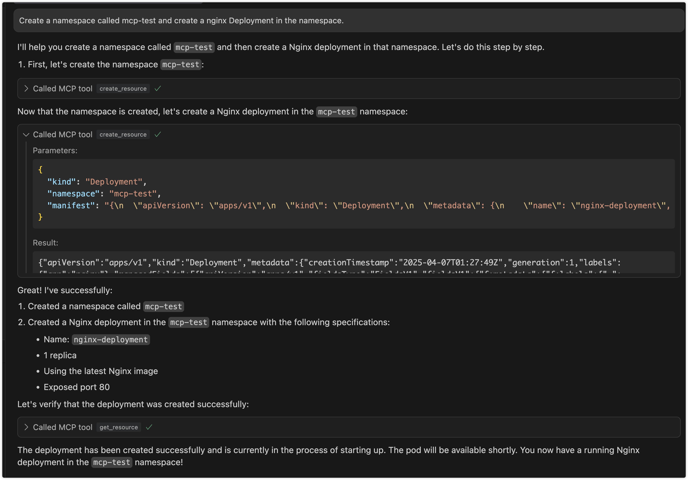

# mcp-k8s

A Kubernetes MCP (Model Control Protocol) server that enables interaction with Kubernetes clusters through MCP tools.

## Features

- Query supported Kubernetes resource types (built-in resources and CRDs)
- Perform CRUD operations on Kubernetes resources
- Configurable write operations (create/update/delete can be enabled/disabled independently)
- Connects to Kubernetes cluster using kubeconfig

## Preview
> Interaction through cursor



## Use Cases

### 1. Kubernetes Resource Management via LLM

- **Interactive Resource Management**: Manage Kubernetes resources through natural language interaction with LLM, eliminating the need to memorize complex kubectl commands
- **Batch Operations**: Describe complex batch operation requirements in natural language, letting LLM translate them into specific resource operations
- **Resource Status Queries**: Query cluster resource status using natural language and receive easy-to-understand responses

### 2. Automated Operations Scenarios

- **Intelligent Operations Assistant**: Serve as an intelligent assistant for operators in daily cluster management tasks
- **Problem Diagnosis**: Assist in cluster problem diagnosis through natural language problem descriptions
- **Configuration Review**: Leverage LLM's understanding capabilities to help review and optimize Kubernetes resource configurations

### 3. Development and Testing Support

- **Quick Prototype Validation**: Developers can quickly create and validate resource configurations through natural language
- **Environment Management**: Simplify test environment resource management, quickly create, modify, and clean up test resources
- **Configuration Generation**: Automatically generate resource configurations that follow best practices based on requirement descriptions

### 4. Education and Training Scenarios

- **Interactive Learning**: Newcomers can learn Kubernetes concepts and operations through natural language interaction
- **Best Practice Guidance**: LLM provides best practice suggestions during resource operations
- **Error Explanation**: Provide easy-to-understand error explanations and correction suggestions when operations fail

## Architecture

### 1. Project Overview

An stdio-based MCP server that connects to Kubernetes clusters and provides the following capabilities:
- Query Kubernetes resource types (including built-in resources and CRDs)
- CRUD operations on Kubernetes resources (with configurable write operations)

### 2. Technical Stack

- Go
- [mcp-go](https://github.com/mark3labs/mcp-go) SDK
- Kubernetes client-go library
- Stdio for communication

### 3. Core Components

1. **MCP Server**: Uses mcp-go's `server` package to create an stdio-based MCP server
2. **K8s Client**: Uses client-go to connect to Kubernetes clusters
3. **Tool Implementations**: Implements various MCP tools for different Kubernetes operations

### 4. Available Tools

#### Resource Type Query Tools
- `get_api_resources`: Get all supported API resource types in the cluster

#### Resource Operation Tools
- `get_resource`: Get detailed information about a specific resource
- `list_resources`: List all instances of a resource type
- `create_resource`: Create new resources (can be disabled)
- `update_resource`: Update existing resources (can be disabled)
- `delete_resource`: Delete resources (can be disabled)

## Usage

mcp-k8s supports two communication modes:

### 1. Stdio Mode (Default)

In stdio mode, mcp-k8s communicates with the client through standard input/output streams. This is the default mode and is suitable for most use cases.

```bash
# Run in stdio mode (default)
{
    "mcpServers":
    {
        "mcp-k8s":
        {
            "command": "/path/to/mcp-k8s",
            "args":
            [
                "-kubeconfig",
                "/path/to/kubeconfig",
                "-enable-create",
                "-enable-delete",
                "-enable-update",
                "-enable-list"
            ]
        }
    }
}
```

### 2. SSE Mode

In SSE (Server-Sent Events) mode, mcp-k8s exposes an HTTP endpoint to mcp client.
You can deploy the service on a remote server (but you need to pay attention to security)

```bash
# Run in SSE mode
./bin/mcp-k8s -kubeconfig=/path/to/kubeconfig -transport=sse -port=8080 -host=localhost -enable-create -enable-delete -enable-list -enable-update
# This command will open all operations
```

mcp config
```json
{
  "mcpServers": {
    "mcp-k8s": {
      "url": "http://localhost:8080/sse",
      "args": []
    }
  }
}
```

SSE mode configuration:
- `-transport`: Set to "sse" to enable SSE mode
- `-port`: HTTP server port (default: 8080)
- `--host`: HTTP server host (default: "localhost")

### 3. Docker environment
#### SSE Mode
  1. Custom version and platform construction：
```bash
docker build \
  --build-arg VERSION=v1.0.2 \
  --build-arg PLATFORM=linux_amd64 \
  -t mcp-k8s .
```
2. Complete Example
Assuming your image name is mcp-k8s and you need to map ports and set environment parameters, you can run:
```bash
docker run --rm -p 8080:8080 -i -v   ~/.kube/config:/root/.kube/config   mcp-k8s   -transport=sse
```
#### stdio Mode

```json
{
  "mcpServers": {
    "mcp-k8s": {
      "command": "docker",
      "args": [
        "run",
        "-i",
        "-v",
        "~/.kube/config:/root/.kube/config",
        "--rm",
        "mcp-k8s"
      ]
    }
  }
}
```


## Getting Started

### Direct Usage
You can directly download the binary for your platform from the [releases page](https://github.com/silenceper/mcp-k8s/releases) and use it immediately.

### Build

```bash
git clone https://github.com/silenceper/mcp-k8s.git
cd mcp-k8s
go build -o bin/mcp-k8s cmd/server/main.go
```

### Command Line Arguments

- `-kubeconfig`: Path to Kubernetes configuration file (uses default config if not specified)
- `-enable-create`: Enable resource creation operations (default: false)
- `-enable-update`: Enable resource update operations (default: false)
- `-enable-delete`: Enable resource deletion operations (default: false)
- `-enable-list`: Enable resource list operations (default: true)
- `-transport`: Transport type (stdio or sse) (default: "stdio")
- `-host`: Host for SSE transport (default "localhost")
- `-port`: TCP port for SSE transport (default 8080)

### Integration with MCP Clients

mcp-k8s is an stdio-based MCP server that can be integrated with any MCP-compatible LLM client. Refer to your MCP client's documentation for integration instructions.

## Security Considerations

- Write operations are strictly controlled through independent configuration switches
- Uses RBAC to ensure K8s client has only necessary permissions
- Validates all user inputs to prevent injection attacks

## Follow WeChat Official Account

